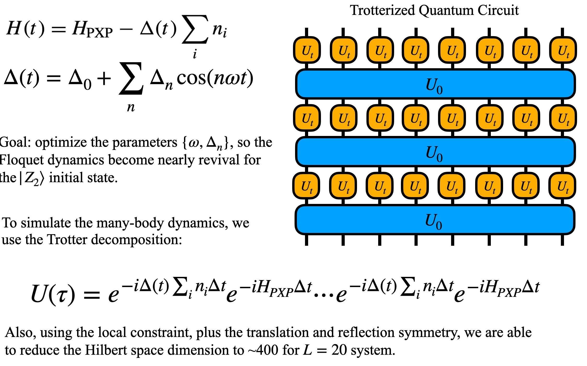
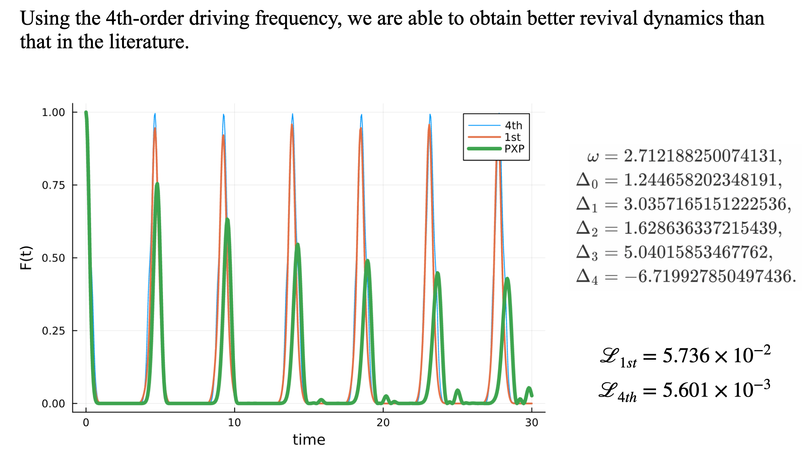

# DrivenPXP
Optimize driven quantum many-body scar dynamics.

## Results

## References

1. H. Bernien, S. Schwartz, A. Keesling, H. Levine, A. Omran, H. Pichler, S. Choi, A. S. Zibrov, M. Endres, M. Greiner, V. Vuletic, and M. D. Lukin, Probing many-body dynamics on a 51-atom quantum simulator, Nature (London) **551**, 579 (2017).
2. D. Bluvstein, A. Omran, H. Levine, A. Keesling, G. Semeghini, S. Ebadi, T. T. Wang, A. A. Michailidis, N. Maskara, W. W. Ho *et al.*, Controlling quantum many-body dynamics in driven Rydberg atom arrays, Science **371**, 1355 (2021).
3. Ana Hudomal, Jean-Yves Desaules, Bhaskar Mukherjee, Guo-Xian Su, Jad C. Halimeh, and Zlatko Papic, Driving quantum many-body scars in the PXP model, Phys.Rev.B.106.104302 (2022).
